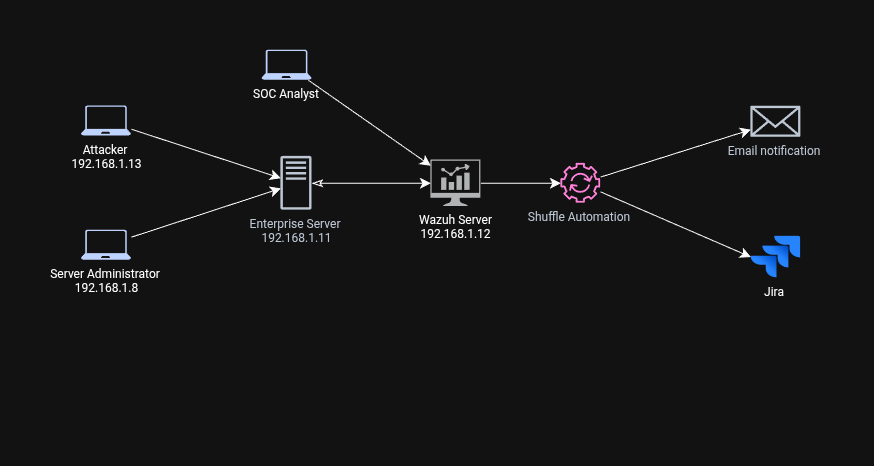

## AUTOMATION RESPONSE SYSTEM

## PROJECT OVERVIEW

Monitoring (company servers) and automatically responding to attacks. This project is divided into separate cases. The following is an overview of the automation lab

**SOC Automation Lab Environment**
- Wazuh server (192.168.1.12)
- Enterprise server (192.168.1.11)
- Administrator server (192.168.1.8)
- Attacker (192.168.1.13)
- Shuffle automation tools
- Email
- Jira management system

## Table of Case
| Case | Description | Link |
| --- | --- | --- |
| SSH login anomaly | Auto detection ssh login anomaly with email notification | [Click This Link](https://github.com/AnggaSOC/Cyber/tree/main/Defensive%20Security/Automation%20Response/Suspicious%20Login%20Detection) | 
| Dos/DDos attack | Active response and blocked Dos/DDos attack with automation email alert and incident ticketing with Jira | [Click This Link](https://github.com/AnggaSOC/Cyber/tree/main/Defensive%20Security/Automation%20Response/DoS-DDos%20Attack) |

