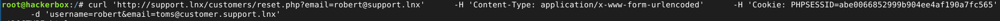

# AUTHENTICATION BYPASS

# Project Overview
Testing the security of authentication systems using various methods: brute force attacks, gathering user credentials, manipulating password reset features, and cookie tampering attack.

# Result

##  Sign up feature & credential brute force

**1. Looking for error messages from features**

The message "an account with this username already exists" indicates that the username already exists. This is a critical vulnerability, as an attacker can simply guess the password, for example, using brute force.

**2. Credential Harvesting**

Using ffuf to collect usernames using a general username list and successfully found several valid usernames.

**3. Password Brute Force**

Successfully found the passwords of 2 valid usernames using only a wordlist of frequently used passwords.

## Reset Password Manipulate & Cookie Tampering

**1. Reset password for valid username**
Reset the password for username: robert. The system asks to enter a valid username, and we can tamper with it so that the password reset link for username: robert is sent to your email.

**2. Tampering with cookie -curl**

