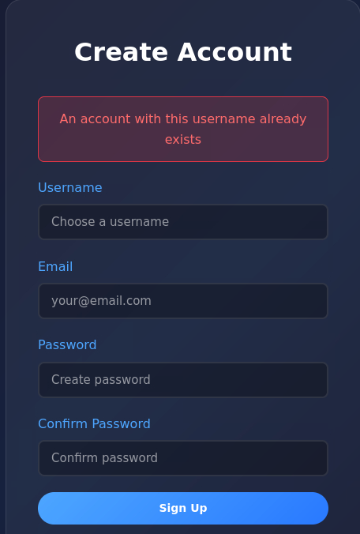
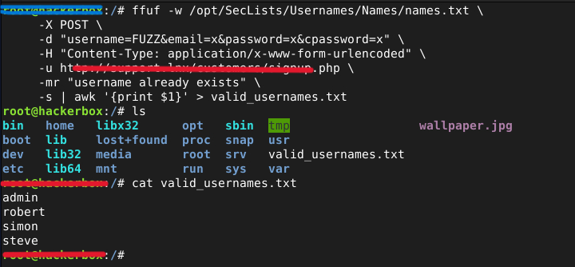
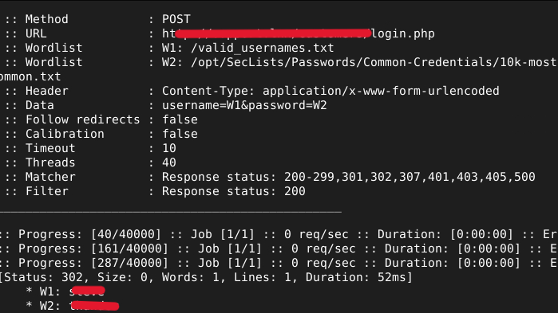
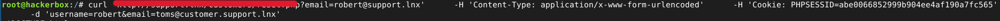
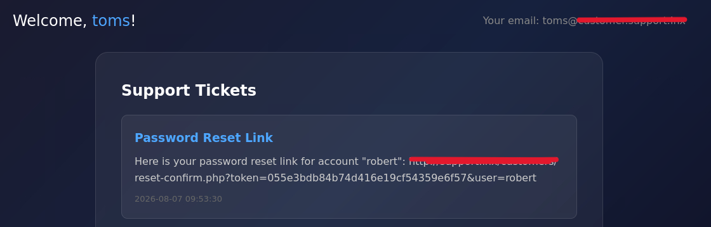

# AUTHENTICATION BYPASS

# Project Overview
Testing the security of authentication systems using various methods: brute force attacks, gathering user credentials, manipulating password reset features, and cookie tampering attack.

# Result

##  Sign up feature & credential brute force

**1. Looking for error messages from features**

The message "an account with this username already exists" indicates that the username already exists. This is a critical vulnerability, as an attacker can simply guess the password, for example, using brute force.

**2. Credential Harvesting**

Using ffuf to collect usernames using a general username list and successfully found several valid usernames.

**3. Password Brute Force**

Successfully found the passwords of 2 valid usernames using only a wordlist of frequently used passwords.

## Reset Password Manipulate & Cookie Tampering

**1. Reset password for valid username**
Reset the password for username: robert. The system asks to enter a valid username, and we can tamper with it so that the password reset link for username: robert is sent to your email.

**2. Tampering with cookie -curl**

Using cURL to tamper with data. Using session cookies and manipulating the destination email address for password resets.

**3. Reset password link success**

The password reset link for username 'robert' has been successfully sent to the test email address.

Successfully obtained Robert's account using a password reset manipulation method.

# REPORT

- ID Report : ABP-090826
- Severity Level : High-Critical
- Risk : Account theft and hijacking
- Resource : MITRE ATT&ck T1078, T1539, T1098, T1003, T1563
- Description : Authentication bypass testing
- Findings :
  * Error message vulnerability: notifying that a valid username has already been registered. This gives an attacker a loophole to determine the valid username.
  * Application does not limit login error: attacker can brute force attack
  * Manipulated password reset form: attackers can perform session tempering/hijacking to gain access.
- Mitigation & Remediation :
  * Limit the number of failed logins: for example, if 10 failed attempts occur, the account will be suspended for a few minutes to prevent brute force attacks.
  * Logical errors are more dangerous than technical vulnerabilities: errors in the design and implementation of business logic can be exploited by attackers to manipulate login.
  * Avoid system error messages that contain sensitive information.

