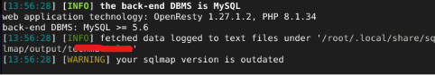
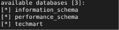
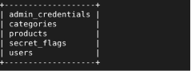
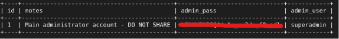
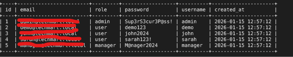

# AUTOMATED SQL INJECTION

## PROJECT OVERVIEW
Automatically exploiting SQL injection vulnerabilities using the sqlmap tool.

## RESULT
**1. Looking for information about databases**

The website uses MySQL version 5.6 and PHP 8.1.34. This information is very useful for further exploitation.

**2. Exploit Techmart Database**

**3. List of TechMart database tables**

Target the most crucial table `admin_credential` and `users`

**4. Dump Admin Credential Table**

**5. Dump Users Table**

## REPORT

* Report ID : SQLM-130826
* Severity Level : High
* Risk :  An attacker can misuse a database: create, manipulate, and even delete the victim's sensitive and important information
* Resource : CWE-89
* Tools Used : Sqlmap, Kali Linux Terminal
* Findings :
* 
