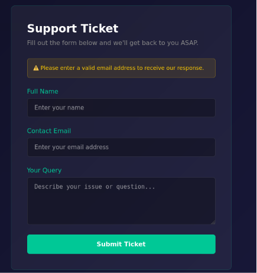
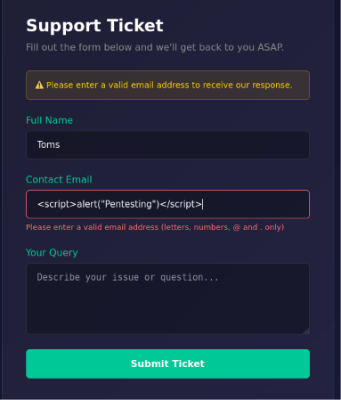
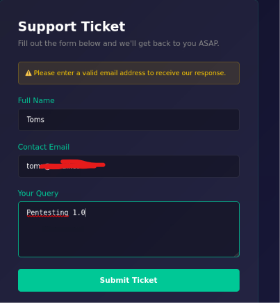
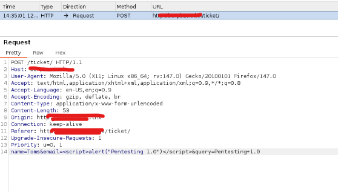
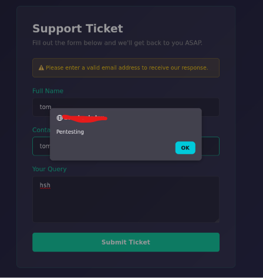

# CROSS-SITE SCRIPTING

## PROJECT OVERVIEW
Testing for cross-site scripting (XSS) vulnerabilities in the customer support ticket feature.

## RESULT

**1. Inject with Javascript Code**

The system successfully rejected user input other than email. The system has implemented defenses against characters commonly used for script injection.

**2. Burp suite : To Capture and Modify Requests**

The email field was successfully injected with JavaScript to manipulate the input. Valid: Cross-site scripting

## REPORT

* Report ID : RFC-130826
* Severity Level : Low-Medium
* Risk : Defaces the website and annoys users. Potential session hijacking if an attacker uses an advanced XSS attack.
* Resource : OWASP Top 10: A05-Injection
* Tools Used : Internet browser, Burp Suite
* Findings :
  - The system has implemented defense and sanitization of some characters commonly used for injection in client-side only, but not in server-side.
  - The server side isn't sanitized, making it very easy to bypass such defenses. Once a request successfully passes the client-side check, it can be bypassed on the server side.
* Remediation :
  - Implement user input sanitization on both client and server side
