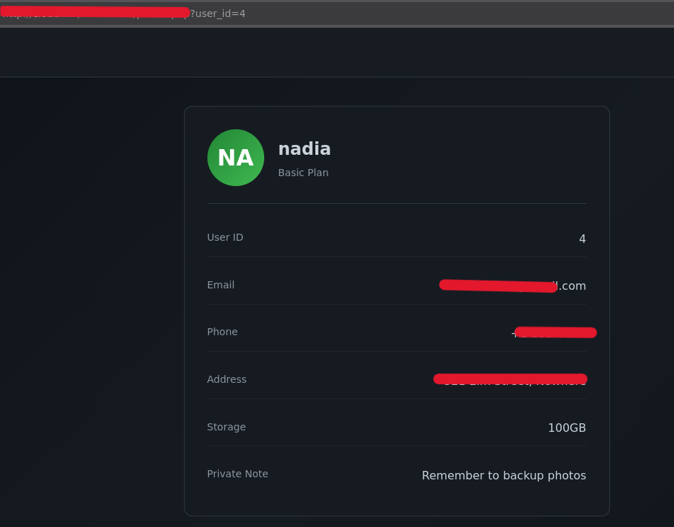
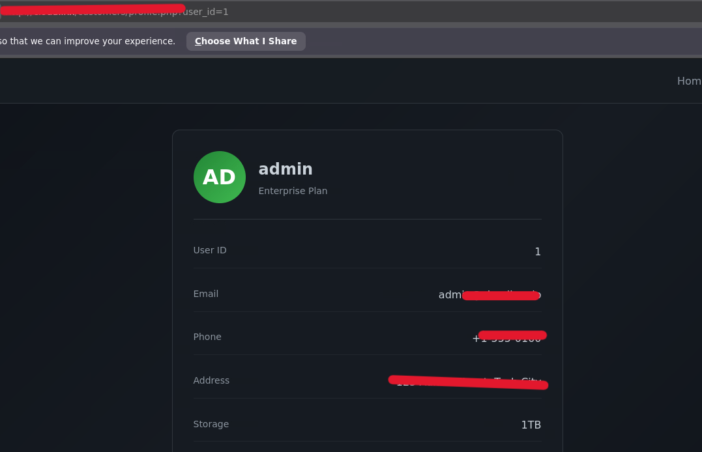
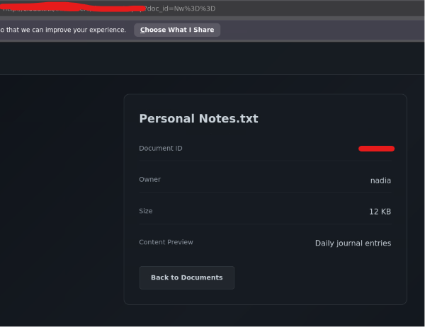
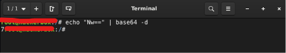
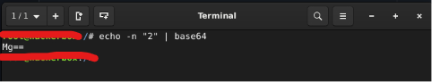
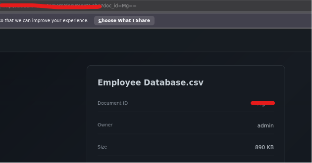
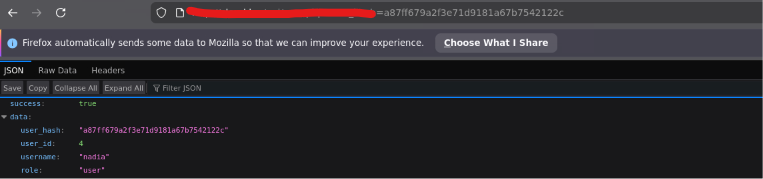
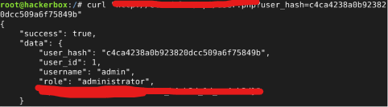

# IDOR
## Project Overview 
Identifying and exploiting IDOR vulnerabilities present in features of a web app
## Result
**1. Detail profile IDOR**

There is an IDOR vulnerability in the profile details, as indicated by the URL parameter that can directly accept user input for `user_id`. Users can directly change the values of the URL parameters.

**2. IDOR with URL encoding**

The ID parameter displayed in the URL—even when encoded—can still be decoded and injected into this vulnerability

**3. Inject Payload in URL**

Inject a payload containing the encoded `user_id` into the URL parameter. The result is a valid IDOR.

**4. IDOR in md5 Hash**

The `user_id` has been converted to an MD5 hash. This vulnerability can be exploited by entering another `user_id` that has been hashed. Although the hash cannot be decoded, it can be cracked.

## REPORT

* Report ID : PIR-80126
* Severity Level : High-Critical
* Risk : An user/attacker can exploit this vulnerability to access documents or objects by modifying the ID parameter
* 

