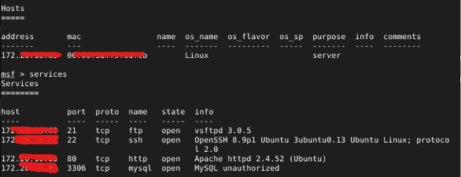
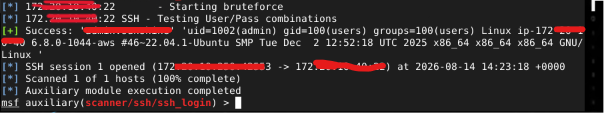
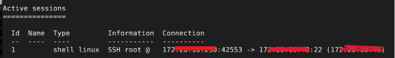
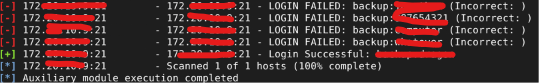
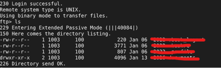
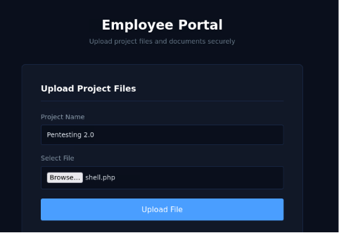
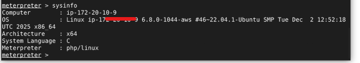

# METASPLOIT : EXPLOITATION

## PROJECT OVERVIEW
Conduct a series of penetration tests to identify and exploit vulnerabilities: from reconnaissance to post-exploitation

## RESULT

**1. Reconnaissance**

Information obtained :
- FTP Server running - Brute-force potential
- SSH Server running - Brute-force potential
- Web Server running - Corporate website portal
- MySQL running - Database server

**2. Exploit SSH Service**

Successfully brute-forced the SSH service credentials, and a session has been established in Meterpreter.

**3. Exploit FTP Service**

Successfully performed a brute-force attack on the FTP service using a credential wordlist. Logged in using valid credentials and gained full access to the FTP server.

**4. Bls**

An upload feature with no validation of user input. The system allows .php files to be uploaded and executed. The file was successfully uploaded and a reverse shell was established. Full access to the server was successfully obtained (RCE).

## REPORT
* Report ID : MRCE-150826
* Seveirty Level : Critical
* Risk : Server Takeover
* Resource : OWASP Top 10: A05-Injection, A06-Insecure Design, A07-Authentication Failures, A08-Software and Data Integrity Failures
* Findings :
  - There are no limits on failed authentication attempts, so brute-force attacks are successful against the SSH and FTP services
  - There is no validation of user input on either the client or server side, so .php files containing a reverse shell can be uploaded
  - User uploads are not handled properly: file names are not renamed before being saved to the database. These files can be executed via the browser using the same filename to execute a reverse shell command.
  - The system does not block port 4444, which is commonly used for reverse shells
* Remediation :
  - Limit the number of failed authentication attempts to prevent brute-force attacks; temporarily suspend IP addresses or accounts that fail to log in.
  - Always validate user input on both the client and server sides before uploading it.
  - Rename the uploaded file to a random string so that it cannot be guessed and executed
  - Block port 4444, which is commonly used for reverse shells
