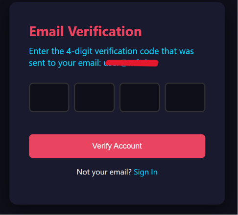
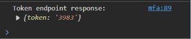

# MULTI-FACTOR AUTHENTICATION BYPASS

## Project Overview
Testing the security of multi-factor authentication by attempting to bypass it using several methods.

## RESULT

**1. OTP Token Delivery Configuration Error**

The OTP code is sent by the system to the recipient's email address, but it can be intercepted by a browser using DevTools. 

**2. OTP Token Bypass**

The OTP code requirement can be bypassed by replacing the URL directly with `/dashboard`. There is no code verification. When the user enters the correct credentials, the system grants access to the dashboard page.

## REPORT

- Report ID : MFAR-110826
- Severity Level : Medium-High
- Risk : Account takeover
- Resource : Mitre ATT&CK T1111, T1556, T1556.006
- Description : MFA Bypass
- Findings :
  * The browser can capture OTP codes that it shouldn't be able to capture. If the attacker knows the credentials, there’s no need to know the code sent to the email. It’s enough to view the code intercepted in the browser
  * There is no verification code, and you can bypass it simply by changing the URL to `/dashboard` 
