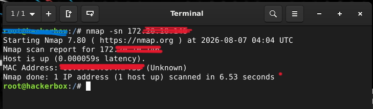
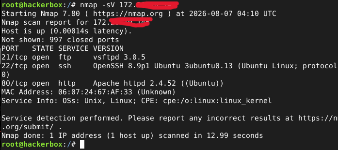
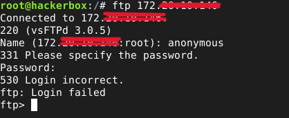

# NETWORK SECURITY: Nmap

## PROJECT OVERVIEW
Server network security testing using the Nmap tool to detect vulnerabilities before they are misused by attackers.

## RESULT
**1. View and identify active hosts**

**2. Identify what ports and services are currently active

Three port open: 21,22,80. FTP services are not secure because they provide unencrypted data and can be intercepted by hackers on the same network.

**3. Exploit ftp service**

The login attempt failed, but if exploited further the attacker will get the login credentials, for example by brute force attack.

## REPORT

* Report ID : P080826-0001
* Severity Level : Medium-High
* Risk : If exploited, an attacker can obtain credentials
* Resource : OWASP Top 10: A02-Security Misconfiguration, A06-Insecure Design
* Tool Used : Nmap
* Findings :
  - Port 21,22: ftp & ssh open ports and potentially exploitable by attackers on the same network/if the IP address is known.
  - The login attempt failed, but if exploited further the attacker will get the login credentials, for example by brute force attack. Further exploitation is needed to obtain credentials by brute force.
* Remediation :
  - Turn off unused services or change to an unusual port, for example 222, 223, etc.
  - Don't use FTP because it's not secure. Use something more secure like SFTP, FTPS, or SSH.

