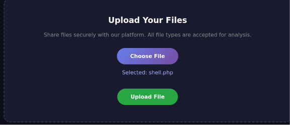
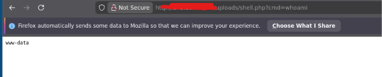
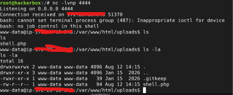

# REMOTE CODE EXECUTION : FILE UPLOAD VULNERABILITY

## PROJECT OVERVIEW 
Exploiting file upload vulnerabilities 

## RESULT
**1 Upload php file**

Successfully uploaded a file with the .php extension containing malicious code. The system does not filter out extensions that should not be allowed to be uploaded.

**2. Access to system**

The PHP file containing the reverse shell was successfully executed by the system. The system does not rename files uploaded by users. Therefore, once a user knows where the file is stored, they can simply execute the file containing the reverse shell code to gain access to the system or server.

**3. Remote Code Execution**

The system or server can be fully controlled (RCE). This vulnerability falls under the OWASP Top 10: A02 - Security Misconfiguration and A06 - Insecure Design. This vulnerability has a maximum and critical impact.

## REPORT

* Report ID : RRCE-140826
* Severity Level : Critical
* Risk : Remote code execution, Full control over system or server access
* Resource : OWASP Top 10 : A02-Security Misconfiguration, A06-Insecure Design
* Findings :
  - The system accepts all user input without restrictions. As a result, users can upload files containing malicious code.
  - The system does not rename files uploaded by users. Therefore, users simply have to guess the directory where the files are stored.
  - The system allows files to be executed due to poor system design: it allows system commands such as exec(), shell_exec(), etc.
  - 
